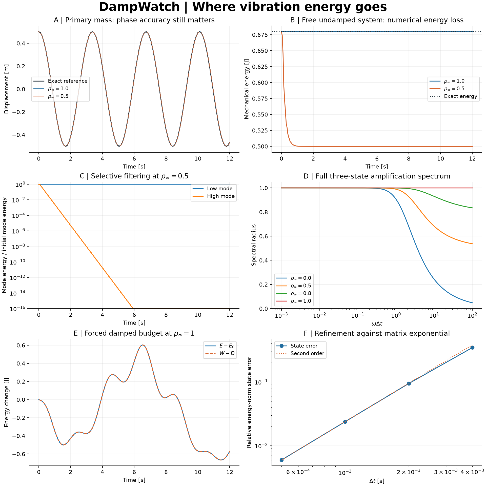

# DampWatch

**Where does vibration energy go: the damper, or the time integrator?**

DampWatch is an original structural-dynamics laboratory. It implements the
generalized-alpha method for small linear systems, exposes a discrete energy audit,
and checks results against closed-form oscillators and an independent matrix
exponential. A synthetic primary mass with a stiff attachment shows how numerical
damping suppresses an underresolved mode while preserving a well-resolved one.
Energy conservation alone does not guarantee phase accuracy.



## Quick start

Python 3.11 or newer. NumPy/SciPy supply compiled linear algebra; no custom C++
extension or compiler is required. Internet is needed for the first dependency install.

```bash
git clone https://github.com/racostacme-come/dampwatch.git
cd dampwatch
python -m venv .venv
# Linux/macOS:
source .venv/bin/activate
# Windows PowerShell instead:
# .venv\Scripts\Activate.ps1
python -m pip install -e ".[dev]"
dampwatch --output out
python examples/energy_audit.py
```

If PowerShell activation is restricted, invoke `.venv\Scripts\python.exe` directly
and use `python -m dampwatch.cli --output out`. `--no-plot` writes CSV/JSON only;
`--help` lists options. The CLI replaces named reports in its output directory and
exits nonzero if an acceptance check fails. Use `pip install .` for regular installs
and `python -m build` for source/wheel distributions.

[`requirements-repro.txt`](requirements-repro.txt) records the Windows/Python 3.14
dependency snapshot, not a universal lock. On a matching environment install it
before `pip install .`; package metadata specifies supported dependency ranges.

## Governing problem and method

Unconstrained degrees of freedom obey

$$M\ddot u+C\dot u+Ku=f(t),\qquad u(0)=u_0,\quad\dot u(0)=v_0.$$

Matrices are real, constant and symmetric. Mass is positive definite; damping and
stiffness are positive semidefinite (rigid modes are allowed). Constraints must be
eliminated beforehand. Initial acceleration comes from the physical equation.

With $x_{n+1-\alpha}=(1-\alpha)x_{n+1}+\alpha x_n$, each step enforces

$$M a_{n+1-\alpha_m}+C v_{n+1-\alpha_f}+K u_{n+1-\alpha_f}
=(1-\alpha_f)f_{n+1}+\alpha_f f_n.$$

For a requested asymptotic spectral radius $0\le\rho_\infty\le1$,

$$\alpha_m=\frac{2\rho_\infty-1}{1+\rho_\infty},\quad
\alpha_f=\frac{\rho_\infty}{1+\rho_\infty},\quad
\gamma=\tfrac12+\alpha_f-\alpha_m,\quad
\beta=\tfrac14(1+\alpha_f-\alpha_m)^2.$$

Predictors $u^p=u_n+h v_n+h^2(1/2-\beta)a_n$ and
$v^p=v_n+h(1-\gamma)a_n$ give the acceleration system

$$[(1-\alpha_m)M+(1-\alpha_f)\gamma h C+(1-\alpha_f)\beta h^2K]a_{n+1}
=f_{n+1-\alpha_f}-\alpha_mMa_n
-C[(1-\alpha_f)v^p+\alpha_fv_n]-K[(1-\alpha_f)u^p+\alpha_fu_n].$$

Then $u_{n+1}=u^p+\beta h^2a_{n+1}$ and $v_{n+1}=v^p+\gamma h a_{n+1}$.
One Cholesky factorization is reused for a fixed time step. Loads use **weighted
endpoint samples**, not a fresh sample at the intermediate time. The method is
second order for smooth linear problems; linear stability does not remove
time-resolution requirements.

At rho=1, consistent initial acceleration and endpoint loads give the
average-acceleration Newmark trajectory. The full three-state amplification map
contains a parasitic acceleration mode: `amplification_matrix` retains it by
propagating three independent basis vectors. PETSc/OpenSees use complementary
alpha conventions; convert weights before comparing parameter values.

## What the energy audit means

For $E_n=(v_n^TMv_n+u_n^TKu_n)/2$, define

$$D_n=\sum_{j<n}h\bar v_j^TC\bar v_j,\quad
W_n=\sum_{j<n}\bar f_j^T(u_{j+1}-u_j),\quad
R_n=E_n-E_0+D_n-W_n,$$

where bars mean arithmetic endpoint averages. At rho=1, the kinematics imply
$\Delta u=h\bar v$ and $\Delta v=h\bar a$. Dotting mean equilibrium with
$\Delta u$ proves $R_n=0$ up to roundoff, even with non-proportional damping and
arbitrary sampled loads.

For smaller rho, **R is a signed discrete budget defect** containing integration
and work/dissipation quadrature errors. It is not a guaranteed monotone algorithmic
energy or a measurement of material damping. Negative R means extra loss under
this audit. For free undamped motion D=W=0, so energy change directly reveals
numerical loss. D approximates physical dissipation on the numerical trajectory;
it is not an exact continuous-time integral.

## Reproducible experiment

The original ideal spring-mass model is
`ground -- 4 N/m -- 1 kg -- 600 N/m -- 0.15 kg`.
Frequencies are 1.864904 and 67.827149 rad/s. Mass-normalized modal coordinates
start at $q_0=[1/\omega_1,0.6/\omega_2]^T$, with zero velocity and modal energies
0.50 and 0.18 J. The free study uses h=0.05 s for 12 s: omega*h is approximately
0.093 and 3.39. It intentionally underresolves the attachment mode.

The forced study uses $C=0.06M+0.0001K$, $f=[0.8\sin(1.2t),0]^T$ N,
h=0.02 s and rho=1. Separate damped free-response refinement compares against
`expm(A*t)` on the augmented state $[u,v,1]^T$, with

$$A=\begin{bmatrix}0&I&0\\-M^{-1}K&-M^{-1}C&M^{-1}f\\0&0&0\end{bmatrix}.$$

This allows constant forcing and singular K without inverting stiffness. Each
reference time is evaluated independently. Convergence error is the maximum of
$\sqrt{\Delta u^TK\Delta u+\Delta v^TM\Delta v}/\sqrt{2E_0}$ at 101 common times
over 2 s. This is an energy seminorm when rigid modes exist; the showcase K is
positive definite. 'Exact' means exact in time up to matrix-exponential roundoff.

Recorded Windows/Python 3.14 results (roundoff varies by platform):

| Check | Result |
| --- | ---: |
| Undamped energy drift, rho=1 | 6.63e-14 relative |
| Forced budget defect, rho=1 | 7.53e-14 normalized |
| Low-mode energy retained, rho=0.5 | 99.9309% |
| High-mode energy retained, rho=0.5 | Below floating-point significance |
| Spectral radius at omega*h=1e7, rho=0.5 | 0.50001685 |
| Finest observed state convergence order | 1.99835 |
| Finest state error, h=0.0005 s | 0.00595545 relative |

Observed orders improve from 1.873 to 1.987 to 1.998. Coarse-step errors are
substantial. The modal-energy plot clips at 1e-16; its final tiny numerical value
is not physically meaningful. Conserving energy does not recover high-mode phase.

[`results/validation.json`](results/validation.json) contains model parameters,
metrics and eight acceptance checks. CSVs expose free response, forced budget,
refinement and spectral curves. [`docs/validation.md`](docs/validation.md) records
verification scope and development findings. No timing/performance claim is made.

## Python API

```python
from dampwatch import System, integrate, energy_budget, exact_response

system = System(mass=[[2.0]], damping=[[0.4]], stiffness=[[8.0]])
history = integrate(system, [1.0], [0.0], dt=0.01, steps=1000, rho_inf=0.5)
budget = energy_budget(system, history)
u_exact, v_exact = exact_response(system, [1.0], [0.0], history.time)
print(budget.defect[-1])
```

`System` copies inputs and checks shape/finiteness/symmetry/definiteness; matrices
are read-only. Tiny asymmetry is symmetrized; semidefinite checks permit a 1e-12
relative negative-eigenvalue tolerance. Use self-consistent units.
`integrate(..., force=lambda t: [...])` accepts a vector callback sampled once per
endpoint. Zero steps returns initial values. `History` holds time and `(steps+1,
ndof)` displacement, velocity, acceleration and force arrays. Result arrays are
mutable; audits assume compatible, unmodified histories.
`exact_response(..., force=[...])` accepts constant loads only. `Parameters` exposes
scheme coefficients. `amplification_matrix(x, rho)` returns the undamped scalar map
on `[u, h*v, h*h*a]` at x=omega*h.

## Checks and structure

```bash
ruff check .
ruff format --check .
python -m pytest --cov=dampwatch --cov-report=term-missing
python -m build
python -m pip check
```

CI covers Ubuntu/Windows and Python 3.11/3.14, source/wheel builds, wheel reinstall
and tests, the CLI/example, and report artifacts. `src/dampwatch/dynamics.py` holds
the numerical API; `study.py` the experiment; `tests/` analytical, invariant,
input-contract and artifact checks. Two feature branches preserve development
history, with checks before merging. See [contributing](CONTRIBUTING.md).

## Limitations and provenance

Dense constant linear matrices only: no FEM assembly, nonlinear/contact mechanics,
time-varying matrices, constraints/DAEs, sparse solve, adaptivity, restart or
large-system optimization. Storage is O(steps*ndof), factorization O(ndof^3), and
stepping O(steps*ndof^2). Abrupt loads require careful resolution; smooth-problem
convergence does not cover impulses. Poor scaling or nearly singular matrices can
degrade accuracy; extreme floating-point scales are unvalidated. Full-map
eigenvalues coalesce at extreme frequencies for rho=1, making numerical radius
estimates ill-conditioned. This is a research/educational implementation, not a
certified design solver.

Topic selection used the local Structural Dynamics course folder and CFD lab
lecture filenames for explicit/implicit Euler and Runge-Kutta time integration.
Only names were inspected; no exams or course contents were opened, copied or
published. This original structural generalized-alpha experiment extends those
concepts using public references. All example data are synthetic. [MIT license](LICENSE).

## References

- J. Chung and G. M. Hulbert (1993), *A Time Integration Algorithm for Structural
  Dynamics With Improved Numerical Dissipation: The Generalized-alpha Method*,
  J. Applied Mechanics 60(2), 371-375. [DOI](https://doi.org/10.1115/1.2900803).
- [PETSc TSAlpha2SetRadius](https://petsc.org/release/manualpages/TS/TSAlpha2SetRadius/):
  damping parameterization, with complementary alpha weights.
- [OpenSees generalized-alpha](https://openseesdocumentation.readthedocs.io/en/latest/user/manual/analysis/integrator/GeneralizedAlpha.html):
  definitions and convention caveat.
- [SciPy matrix exponential](https://docs.scipy.org/doc/scipy/reference/generated/scipy.linalg.expm.html):
  independent state-space reference.

## Academic paper

Read the [research note (PDF)](paper/paper.pdf), edit the [LaTeX source](paper/paper.tex),
or follow the [compilation instructions](paper/README.md). The manuscript includes
methods, measured validation, limitations, and references within five pages.
